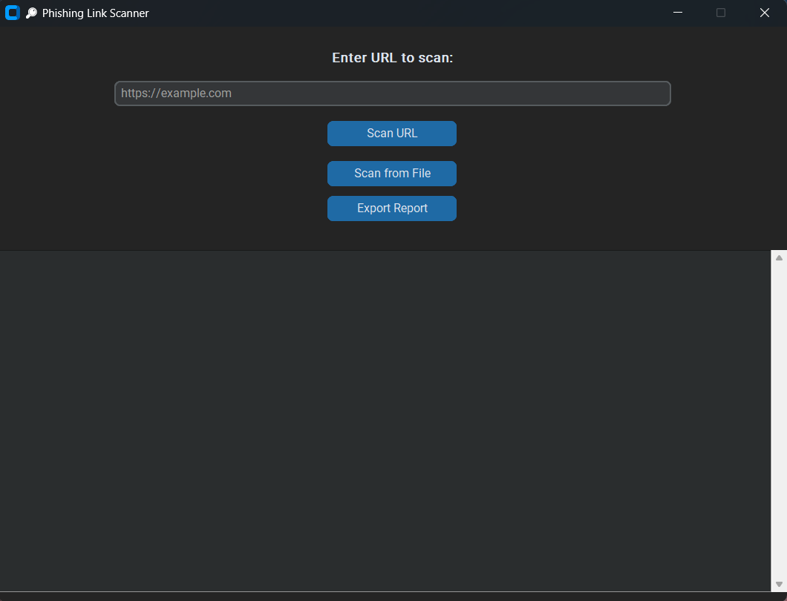
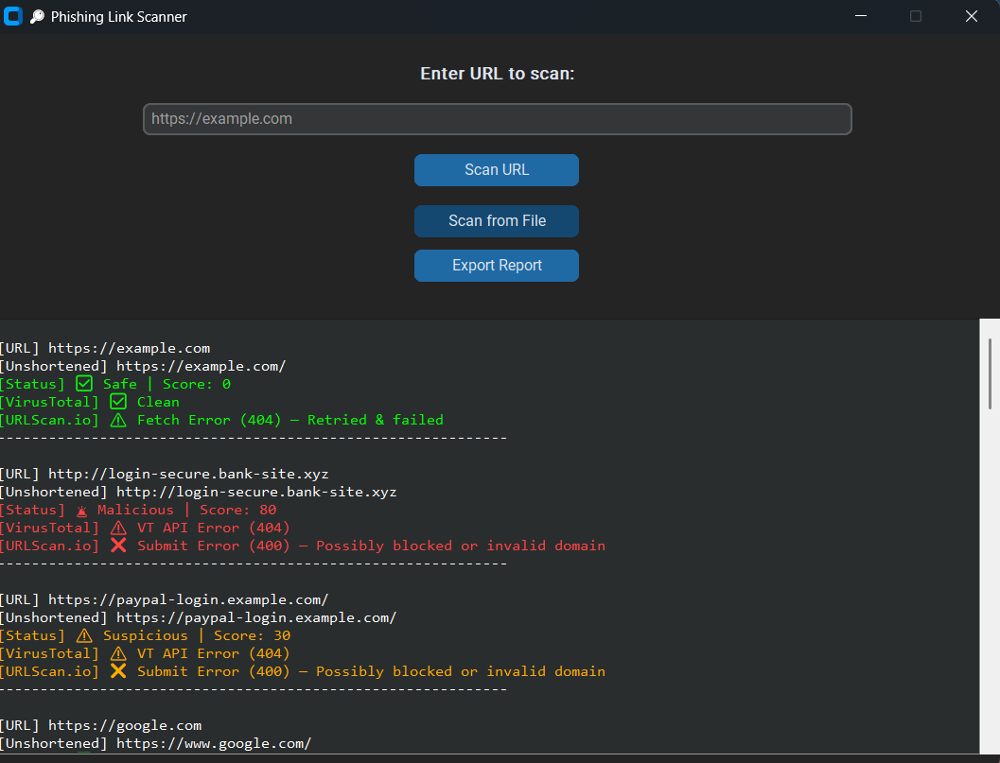

# 🔎 Phishing Link Scanner

---

A professional-grade phishing detection tool built with Python and CustomTkinter. This scanner classifies URLs as **Safe**, **Suspicious**, or **Malicious** using:

- Threat scoring based on phishing indicators
- VirusTotal reputation API
- URLScan.io API analysis
- Support for unshortened links
- Clean, dark-themed GUI interface

---

## 🚀 Features

- 🎨 CustomTkinter dark grey-themed GUI
- 🔍 Scan individual URLs or bulk from `.txt` file
- ✅ Unshortens shortened links (e.g. bit.ly, t.co)
- 🧠 Heuristic threat score calculation
- 🌐 VirusTotal API integration
- 🔬 URLScan.io API support (with retry logic)
- 🔁 Threaded background scanning (no GUI freeze)
- 🌀 Loading spinner during scans
- 💾 Export scan report to `.txt`
- 🎨 Color-coded result display:
  - 🟢 Safe
  - 🟠 Suspicious
  - 🔴 Malicious / Invalid

---

## 📂 Project Structure

```
phishing-link-scanner/
├── gui_app.py              # Main GUI
├── scanner.py              # Core logic & CLI tool
├── .env                    # Stores your API keys 
├── utils/
│   ├── unshortener.py      # URL unshortening
│   ├── virustotal.py       # VirusTotal integration
│   └── urlscan.py          # URLScan.io integration
├── urls.txt                # Optional input list for CLI scan
├── scan_report.txt         # Output report
├── screenshots             # screenshot of Output
│   ├── ss1.png
│   └── ss2.png
└── README.md
```

---

## 📸 GUI Preview



---

## 🧠 How It Works

1. **URL is entered or loaded from file**
2. **URL is unshortened**, if applicable
3. **Threat score is calculated** based on:
   - IP-based pattern
   - Presence of phishing keywords (e.g., `paypal`, `secure`, `verify`)
   - Whether it's shortened
4. **Reputation checks** via:
   - **VirusTotal API**
   - **URLScan.io API**
5. **Final classification**:
   - Score ≥ 60: 🚨 Malicious
   - 25 ≤ Score < 60: ⚠️ Suspicious
   - Score < 25: ✅ Safe
6. **Output shown in GUI** with appropriate colors

---

## 🛠️ Requirements

- **Python 3.10+**
- **CustomTkinter** – for modern GUI interface
- **tkinter** – base GUI framework (used by CustomTkinter)
- **threading** – for non-blocking background scans
- **requests** – for API calls (VirusTotal, URLScan, etc.)
- **validators** – to validate and sanitize URLs
- **python-dotenv** – to manage API keys securely from `.env` file
- **base64** – for encoding URLs for VirusTotal
- **time** – for delays and retries
- **re** – regular expressions to detect IPs and keywords
- **os** – file operations and environment variables

---

## 📦 Installation

```bash
git clone https://github.com/your-github/phishing-link-scanner.git

cd phishing-link-scanner

pip install -r requirements.txt
```

---

## 🔐 API Keys Required ##

```bash
1. Create a `.env` file in the project root:
```

*VIRUSTOTAL_API_KEY* = your_virustotal_key_here    # Replace it with your virustotal API Key

*URLSCAN_API_KEY* = your_urlscan_key_here          # Replace it with your urlscan API Key

--- 

## ▶️ Usage ##
### Run the GUI: ###
```bash
python gui_app.py
```

### Run CLI mode: ###
```bash
python scanner.py
```

*Place URLs in urls.txt (one per line)

---

## 🧪 What It Detects

- 🔗 Shortened URLs (bit.ly, tinyurl)

 - 🧠 Phishing words like: login, verify, secure, bank, etc.

 - 🌐 IP-based URLs

- ⚠️ Suspicious domains (.xyz, .phish, malicious-site)

- 🔍 VirusTotal & URLScan reputation scores

---

## 🧪 Phishing Keywords Used ##

```
login, signin, account, verify, secure, update, bank, ebay, paypal,
password, reset, webscr, confirm, security, invoice, payment, unlock,
limited, expired, suspended, verify-now, submit, authentication, validate,
credentials, token, support, alert, warning, helpdesk, recovery
```
*You can expand this list in scanner.py.*

---

## ✅ Output (GUI) ##



---

##🔮 Future Improvements
Here are planned upgrades to make the Phishing Link Scanner more powerful and feature-rich:

## ✅ Export & Reporting
- 📄 Export scan results to PDF with structured formatting
- 📊 Generate summary statistics or pie charts (e.g., Safe vs Suspicious)

## 🎨 UI/UX Enhancements
- 🌗 Light/Dark mode toggle
- 🌀 Improved loading animation (progress indicator for bulk scans)
- 🗂️ Scan history tab (saved locally using JSON or SQLite)

## 🧠 Advanced Threat Intelligence
- 🔍 Check domain age and WHOIS registration data
- 🧠 Integrate AI/ML phishing detection based on URL features
- 🛡️ Use DNS or IP reputation lookups for more accurate scoring

## 🌐 Web & Extension Versions
- 🌐 Build a Flask-based web dashboard
- 🧩 Create a Chrome extension using the same backend logic

## 🔄 Automation & Alerts
- 📅 Scheduled scans (e.g., daily/weekly batch URL scanning)
- 📧 Email or desktop alerts if malicious URLs are found

## 🗂️ File Content Scanning
- 📁 Scan PDFs or HTML pages for embedded phishing links
- 🧾 Automatically extract and scan links from emails

## 🧰 Performance & Integration
- 💾 Cache VirusTotal scans to save quota and boost speed
- 🛠️ Add CLI flags for batch scanning, export type, verbosity

---

## ⚠️ Disclaimer

This project is for educational and ethical use only. Do not use it to scan real phishing links unless permitted. Be responsible.

---

## ⭐ License ##
This project is licensed under the MIT License.

---


